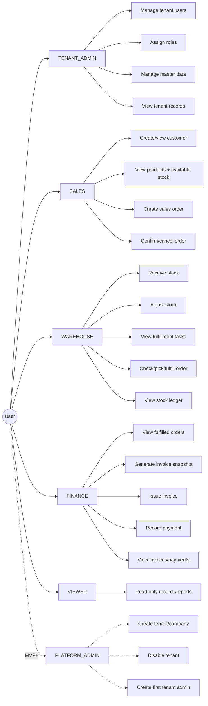
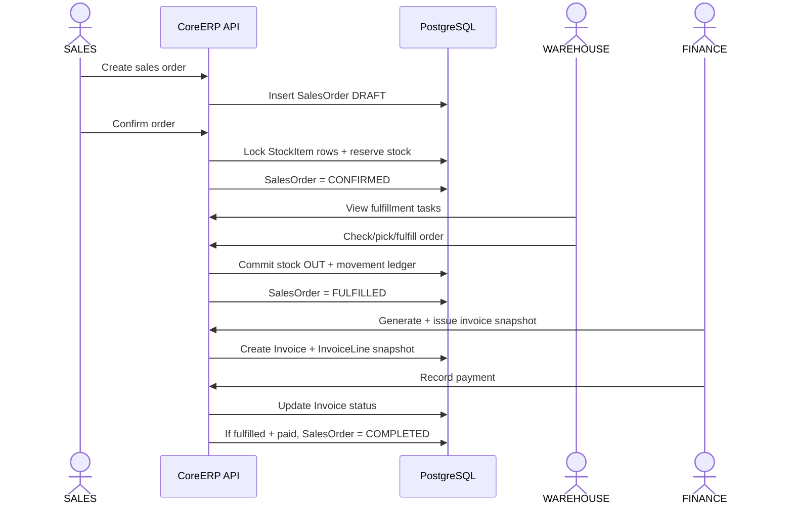

# CoreERP - MVP Requirement & Planning v3

SaaS-ready Multi-tenant Mini ERP Backend for Vietnamese SMBs.

This is a requirement baseline before coding / Codex handoff.

## Executive Decision

CoreERP is a SaaS-ready Multi-tenant Mini ERP Backend. The MVP is an Order-to-Cash module cluster: Sales Order -> Stock Reservation -> Warehouse Fulfillment -> Invoice Snapshot -> Payment -> Order Completion.

## Requirement Corrections from v1

- **SaaS vs module:** Clarified: CoreERP is a SaaS-ready Mini ERP backend; MVP is Order-to-Cash cluster, not full ERP platform.
- **Company creation:** MVP does not expose runtime tenant creation. Two demo tenants are seeded. Platform tenant onboarding is deferred.
- **Admin ambiguity:** Separated Tenant Admin from Platform Admin conceptually. MVP implements Tenant Admin only.
- **Single-person flow:** Added role-based workflow: Sales confirms, System reserves, Warehouse checks/fulfills, Finance invoices/pays.
- **Confirm vs fulfill:** Confirm only reserves stock. Fulfill is the warehouse action that commits stock OUT.
- **Invoice vs stock:** Invoice never mutates inventory. Stock mutation happens only in Inventory/Warehouse operations.
- **Reservation API:** Reservation is internal service behavior triggered by order confirmation, not a public arbitrary endpoint.
- **Status model:** Defined SalesOrder, StockReservation and Invoice statuses and allowed transitions.
- **Data isolation:** Every tenant-owned business table has tenantId and backend derives tenantId from JWT, not request body.

## MVP Scope v2 - In Scope

- **Tenant & Auth:** Login by tenantCode + email + password; JWT contains tenantId, userId, role.
- **Tenant Users/RBAC:** Tenant Admin can create users inside current tenant only.
- **Master Data:** Customer, Product, Warehouse CRUD with tenant-scoped uniqueness.
- **Inventory Core:** StockItem, StockMovement ledger, receive, adjust, reserve, release, commit.
- **Sales Order:** Create draft, confirm, cancel, fulfill, complete.
- **Warehouse Fulfillment:** Warehouse checks physical stock and commits stock OUT.
- **Invoice & Payment:** Invoice snapshot after fulfillment; partial/full payment tracking.
- **Quality:** Swagger/OpenAPI, Jest tests, Docker Compose, seed data.

## Out of Scope / Advanced

- **Public SaaS signup:** Deferred. Avoid email verification, spam/billing concerns.
- **Runtime tenant creation UI/API:** Deferred. Use seed tenants for MVP; add Platform Admin APIs later.
- **Full accounting ledger:** Deferred. MVP is AR-lite invoice/payment, not accounting system.
- **Purchase/Supplier module:** Deferred. MVP focuses on sales side.
- **Kafka/Redpanda + Outbox:** Advanced after core flow is stable.
- **Redis cache/rate limit:** Advanced except optional simple rate limit later.
- **React Admin frontend:** Optional demo layer after backend acceptance criteria pass.

## Tenant and Company Onboarding Decision

- Tenant = company/workspace using CoreERP.
- MVP uses seed data: 2 demo tenants. No runtime company creation API in MVP.
- Tenant Admin cannot create a new company. Platform Admin is advanced/MVP+.
- Login uses tenantCode + email + password. JWT contains tenantId + userId + role.

```json
{ "tenantCode": "minh-anh-retail", "email": "sales@minhanh.vn", "password": "123456" }
```

## Roles

- **TENANT_ADMIN** (Inside one tenant): Create tenant users; manage master data; override some operations; cannot create other tenants.
- **SALES** (Inside one tenant): Create draft order; confirm order; cancel before fulfillment.
- **WAREHOUSE** (Inside one tenant): Receive/adjust stock; view fulfillment tasks; physical check; fulfill order.
- **FINANCE** (Inside one tenant): Generate invoice snapshot; issue invoice; record payment.
- **VIEWER** (Inside one tenant): Read-only access for demo/reporting.
- **PLATFORM_ADMIN** (Whole platform): Concept only for MVP docs; creates tenants in MVP+; not part of normal ERP flow.

## Core Business Flow v2

```mermaid
flowchart LR
  S1[Sales: Create DRAFT order] --> S2[Sales: Confirm order]
  S2 --> SYS1[System: Validate tenant/customer/product/warehouse]
  SYS1 --> SYS2[System: Reserve stock with DB transaction + row lock]
  SYS2 --> W1[Warehouse: View fulfillment task]
  W1 --> W2[Warehouse: Physical stock check / pick / pack]
  W2 --> W3[Warehouse: Fulfill order]
  W3 --> SYS3[System: Commit stock OUT + movement ledger]
  SYS3 --> F1[Finance: Generate invoice snapshot]
  F1 --> F2[Finance: Issue invoice]
  F2 --> F3[Finance: Record payment]
  F3 --> SYS4[System: Complete order if fulfilled + paid]
```



## Status Model

- SalesOrder: DRAFT -> CONFIRMED -> FULFILLED -> COMPLETED; DRAFT/CONFIRMED -> CANCELLED.
- StockReservation: RESERVED -> COMMITTED or RELEASED.
- Invoice: DRAFT -> ISSUED -> PARTIALLY_PAID -> PAID; CANCELLED where applicable.

## Business Rules Baseline

- **BR-001:** Tenant is the company/workspace boundary. Business data of different tenants must never mix.
- **BR-002:** MVP tenant creation is handled by seed script only. Runtime tenant onboarding is deferred.
- **BR-003:** Tenant Admin can create users only within the current tenant. Client must not submit trusted tenantId.
- **BR-004:** Login requires tenantCode + email + password so the backend can resolve tenant context explicitly.
- **BR-005:** Every tenant-owned business query must include tenantId from authenticated context.
- **BR-006:** SKU, warehouse code, customer code and order/invoice code are unique per tenant, not globally.
- **BR-007:** Create Sales Order only creates DRAFT order and order lines. It does not reserve or reduce stock.
- **BR-008:** Confirm Sales Order validates tenant consistency and reserves stock transactionally.
- **BR-009:** Confirm order does not mean goods have been shipped. It only means stock has been reserved.
- **BR-010:** Reserve stock uses PostgreSQL transaction + row-level lock on StockItem. Redis lock is not source of truth.
- **BR-011:** Available quantity = quantityOnHand - quantityReserved.
- **BR-012:** Warehouse fulfillment is required before stock OUT. Fulfillment commits reservation and creates OUT movement.
- **BR-013:** Invoice generation does not mutate inventory. Invoice is financial evidence only.
- **BR-014:** InvoiceLine must snapshot SKU, product name, quantity, unit price and line total.
- **BR-015:** Payment can be partial or full. MVP rejects overpayment unless explicitly changed later.
- **BR-016:** Order is COMPLETED only when order is FULFILLED and invoice is PAID.
- **BR-017:** SalesOrder cannot be cancelled after fulfillment in MVP. Returns/refunds are advanced.
- **BR-018:** StockMovement is append-only for business meaning. Corrections use ADJUST movement, not editing old movements.
- **BR-019:** Reservation endpoint is not public arbitrary API. It is called internally by SalesOrder confirmation.
- **BR-020:** Platform Admin does not participate in sales, warehouse, invoice or payment workflow.

## Domain Model Baseline

- **Tenant:** `id, code, name, status, createdAt, updatedAt` - Represents a company/workspace.
- **User:** `id, tenantId, email, passwordHash, fullName, role, status` - Tenant-scoped staff account.
- **Customer:** `id, tenantId, code, name, phone, email, taxCode, type, status` - Buyer/customer master data.
- **Product:** `id, tenantId, sku, name, unit, basePrice, status` - Sellable item. SKU unique per tenant.
- **Warehouse:** `id, tenantId, code, name, address, isActive` - Warehouse/location for stock.
- **StockItem:** `id, tenantId, warehouseId, productId, quantityOnHand, quantityReserved, version` - Current stock balance; unique per tenant + warehouse + product.
- **StockMovement:** `id, tenantId, warehouseId, productId, type, quantity, before/after balances, referenceType/id` - Append-only stock ledger.
- **StockReservation:** `id, tenantId, salesOrderId, salesOrderLineId, warehouseId, productId, quantity, status` - Reserved stock per order line.
- **SalesOrder:** `id, tenantId, orderCode, customerId, warehouseId, status, totals, confirmed/fulfilled/completed metadata` - Sales order header.
- **SalesOrderLine:** `id, tenantId, salesOrderId, productId, skuSnapshot, productNameSnapshot, quantity, unitPrice, lineTotal` - Order line with price/product snapshot.
- **Invoice:** `id, tenantId, invoiceCode, salesOrderId, customerId, status, totals, paidAmount, issuedAt` - AR-lite financial document.
- **InvoiceLine:** `id, tenantId, invoiceId, productId?, skuSnapshot, productNameSnapshot, quantity, unitPrice, lineTotal` - Immutable invoice snapshot line.
- **Payment:** `id, tenantId, invoiceId, amount, method, referenceNo, paidAt, createdBy` - Payment record.
- **AuditLog:** `id, tenantId, actorUserId, action, entityType, entityId, before?, after?, createdAt` - Trace important operations.

## Inventory Transaction Pseudocode

```sql
BEGIN;
SELECT * FROM stock_items
WHERE tenant_id = $tenantId
  AND warehouse_id = $warehouseId
  AND product_id = $productId
FOR UPDATE;

available = quantity_on_hand - quantity_reserved;
IF available < requestedQty THEN ROLLBACK;

UPDATE stock_items
SET quantity_reserved = quantity_reserved + requestedQty,
    version = version + 1
WHERE id = $stockItemId;

INSERT INTO stock_reservations (... status = 'RESERVED');
INSERT INTO stock_movements (... type = 'RESERVE');
COMMIT;
```

## API Contract Baseline

| Method | Path | Role | Purpose |
|---|---|---|---|
| POST / /api/v1/auth/login / Public / Login by tenantCode + email + password. |
| GET / /api/v1/me / Authenticated / Current user and tenant context. |
| POST / /api/v1/users / TENANT_ADMIN / Create user inside current tenant only. |
| GET/POST/PATCH / /api/v1/customers / TENANT_ADMIN, SALES / Customer master data; tenant scoped. |
| GET/POST/PATCH / /api/v1/products / TENANT_ADMIN / Product master data; SKU unique per tenant. |
| GET/POST/PATCH / /api/v1/warehouses / TENANT_ADMIN / Warehouse master data. |
| POST / /api/v1/inventory/receipts / WAREHOUSE, TENANT_ADMIN / Receive stock and create IN movement. |
| POST / /api/v1/inventory/adjustments / WAREHOUSE, TENANT_ADMIN / Adjust stock and create ADJUST movement. |
| GET / /api/v1/inventory/stock-items / WAREHOUSE, SALES, TENANT_ADMIN, VIEWER / View stock by product/warehouse. |
| GET / /api/v1/inventory/movements / WAREHOUSE, TENANT_ADMIN, VIEWER / View stock ledger. |
| POST / /api/v1/sales-orders / SALES, TENANT_ADMIN / Create DRAFT sales order. |
| PATCH / /api/v1/sales-orders/{id}/confirm / SALES, TENANT_ADMIN / Validate and reserve stock transactionally. |
| PATCH / /api/v1/sales-orders/{id}/cancel / SALES, TENANT_ADMIN / Cancel before fulfillment and release reservation. |
| GET / /api/v1/warehouse/fulfillment-tasks / WAREHOUSE, TENANT_ADMIN / List CONFIRMED orders waiting for physical check. |
| PATCH / /api/v1/sales-orders/{id}/fulfill / WAREHOUSE, TENANT_ADMIN / Commit reservation and create OUT movement. |
| POST / /api/v1/invoices/from-sales-order/{id} / FINANCE, TENANT_ADMIN / Generate invoice snapshot from FULFILLED order. |
| PATCH / /api/v1/invoices/{id}/issue / FINANCE, TENANT_ADMIN / Issue invoice. |
| POST / /api/v1/invoices/{id}/payments / FINANCE, TENANT_ADMIN / Record partial/full payment. |
| GET / /api/v1/audit-logs / TENANT_ADMIN / Search audit trail. |
| POST / /api/v1/platform/tenants / PLATFORM_ADMIN / Advanced only: create tenant + first tenant admin. |

## Implementation Roadmap

- **P0 - Requirement baseline:** This document, diagrams, MVP scope and non-goals are reviewed before coding.
- **P1 - Foundation:** NestJS, strict TS, ConfigModule, Prisma, PostgreSQL Docker Compose, Swagger, health endpoint.
- **P2 - Auth/Tenant/RBAC:** Tenant/user seed, login tenantCode+email, JWT, guards, @CurrentUser, tenant context.
- **P3 - Master Data:** Customer/Product/Warehouse CRUD, pagination, tenant-scoped unique constraints.
- **P4 - Inventory Core:** StockItem, StockMovement, receive, adjust, reservation service with row locks and tests.
- **P5 - Sales + Reservation:** Create/confirm/cancel order, internal reservation call, status validation.
- **P6 - Warehouse Fulfillment:** Fulfillment task list, physical-check action, commit stock OUT.
- **P7 - Invoice + Payment:** Generate snapshot, issue invoice, record payment, order completion.
- **P8 - Portfolio Polish:** E2E tests, README, seed demo script, Swagger screenshots, architecture diagrams.

## MVP Acceptance Criteria

- **Tenant isolation:** Login as Tenant A cannot see, update or reference Tenant B products/customers/orders.
- **Role isolation:** SALES cannot fulfill stock; WAREHOUSE cannot issue invoice; FINANCE cannot adjust stock.
- **Reservation correctness:** Concurrent confirmations cannot oversell the same StockItem.
- **Warehouse separation:** Confirm order reserves stock but does not decrease quantityOnHand; fulfill decreases quantityOnHand.
- **Invoice snapshot:** Changing Product name/price after invoice does not change existing InvoiceLine.
- **Payment status:** Partial payment sets PARTIALLY_PAID; full payment sets PAID; overpayment rejected in MVP.
- **Order completion:** Order completes only after FULFILLED + PAID.
- **Auditability:** Confirm, cancel, fulfill, invoice issue and payment actions create AuditLog records.

## Codex Handoff Checklist

- [ ] Implement phase by phase.
- [ ] Seed tenants in MVP. Do not build public signup yet.
- [ ] Use tenantCode + email + password login.
- [ ] Do not trust tenantId from request body.
- [ ] Reservation is internal to SalesOrder confirmation.
- [ ] Warehouse fulfillment comes before Invoice/Payment.
- [ ] Keep README honest: SaaS-ready Mini ERP Backend, MVP Order-to-Cash.
---

## 18. User Roles and Use Cases

A user belongs to a tenant/company and has exactly one MVP role. Backend derives `tenantId` and `role` from JWT claims and applies tenant isolation + RBAC on every protected endpoint.

### Use Case Diagram



### Main Business Use Case Sequence



### Role Capability Summary

- **TENANT_ADMIN:** Manage users, assign roles, manage master data, view tenant-wide operations, optionally override business actions in own tenant. Boundary: Cannot create a new company/tenant in MVP. Cannot access other tenants.
- **SALES:** Create/view customers, view product catalog and available stock, create sales order, confirm order, cancel order before fulfillment. Boundary: Cannot receive/adjust stock, fulfill order, issue invoice, record payment or create users.
- **WAREHOUSE:** Receive stock, adjust stock, view confirmed orders, check/pick/pack goods, fulfill order, view stock movement ledger. Boundary: Cannot create invoices, record payments, create users, or normally create sales orders.
- **FINANCE:** View fulfilled orders, generate invoice snapshot, issue invoice, record partial/full payment, view invoices and payments. Boundary: Cannot reserve stock, fulfill orders, adjust stock or create users.
- **VIEWER:** Read-only access to tenant records and simple reports. Boundary: Cannot create, update, confirm, fulfill, issue invoice, pay, or create users.
- **PLATFORM_ADMIN:** Advanced/MVP+ only: create tenant, disable tenant, create first tenant admin. Boundary: Does not participate in normal sales, warehouse, invoice or payment flow.

### Use Case Permission Matrix

| Use Case | TENANT_ADMIN | SALES | WAREHOUSE | FINANCE | VIEWER |
|---|---|---|---|---|---|
| Login | Yes | Yes | Yes | Yes | Yes |
| View own tenant data | Yes | Yes | Yes | Yes | Read-only |
| Create tenant user | Yes | No | No | No | No |
| Assign user role | Yes | No | No | No | No |
| Manage customer | Yes | Yes | No | No | Read-only |
| Manage product | Yes | No | No | No | Read-only |
| Manage warehouse master data | Yes | No | Partial | No | Read-only |
| Receive stock | Yes | No | Yes | No | No |
| Adjust stock | Yes | No | Yes | No | No |
| View available stock | Yes | Yes | Yes | Yes | Read-only |
| Create sales order | Yes | Yes | No | No | No |
| Confirm sales order | Yes | Yes | No | No | No |
| Cancel sales order before fulfillment | Yes | Yes | No | No | No |
| Fulfill order / commit stock OUT | Yes | No | Yes | No | No |
| Generate invoice snapshot | Yes | No | No | Yes | No |
| Issue invoice | Yes | No | No | Yes | No |
| Record payment | Yes | No | No | Yes | No |
| View reports | Yes | Read-only | Read-only | Yes | Read-only |

### API Permission Mapping

| Method | Endpoint | Allowed role(s) | Use case |
|---|---|---|---|
| POST / /api/v1/auth/login / Public / Authenticate tenant user. |
| GET / /api/v1/me / All authenticated roles / Read own profile, tenant and role. |
| POST / /api/v1/users / TENANT_ADMIN / Create user inside current tenant. |
| GET / /api/v1/users / TENANT_ADMIN / List tenant users. |
| POST / /api/v1/customers / TENANT_ADMIN, SALES / Create customer. |
| GET / /api/v1/customers / TENANT_ADMIN, SALES, VIEWER / List/search customers. |
| POST/PATCH / /api/v1/products / TENANT_ADMIN / Manage product catalog. |
| GET / /api/v1/products / TENANT_ADMIN, SALES, WAREHOUSE, FINANCE, VIEWER / Read product catalog. |
| POST/PATCH / /api/v1/warehouses / TENANT_ADMIN / Manage warehouse master data. |
| POST / /api/v1/inventory/receipts / TENANT_ADMIN, WAREHOUSE / Receive stock. |
| POST / /api/v1/inventory/adjustments / TENANT_ADMIN, WAREHOUSE / Adjust stock. |
| GET / /api/v1/inventory/stock-items / TENANT_ADMIN, SALES, WAREHOUSE, FINANCE, VIEWER / View available stock. |
| POST / /api/v1/sales-orders / TENANT_ADMIN, SALES / Create DRAFT order. |
| PATCH / /api/v1/sales-orders/{id}/confirm / TENANT_ADMIN, SALES / Confirm order and trigger reservation. |
| PATCH / /api/v1/sales-orders/{id}/cancel / TENANT_ADMIN, SALES / Cancel before fulfillment. |
| GET / /api/v1/warehouse/fulfillment-tasks / TENANT_ADMIN, WAREHOUSE / List orders waiting for stock check. |
| PATCH / /api/v1/sales-orders/{id}/fulfill / TENANT_ADMIN, WAREHOUSE / Fulfill and commit stock OUT. |
| POST / /api/v1/invoices/from-sales-order/{id} / TENANT_ADMIN, FINANCE / Generate invoice snapshot. |
| PATCH / /api/v1/invoices/{id}/issue / TENANT_ADMIN, FINANCE / Issue invoice. |
| POST / /api/v1/invoices/{id}/payments / TENANT_ADMIN, FINANCE / Record payment. |

### Use Case Acceptance Criteria

- **UC-001:** A SALES user can create and confirm an order but receives 403 when trying to fulfill it.
- **UC-002:** A WAREHOUSE user can fulfill an order but receives 403 when trying to issue an invoice.
- **UC-003:** A FINANCE user can issue invoice and record payment but receives 403 when trying to adjust stock.
- **UC-004:** A VIEWER user can read records but receives 403 for all create/update workflow actions.
- **UC-005:** A TENANT_ADMIN can create tenant users but the backend assigns current tenantId automatically.

### Codex Notes

- Implement role permissions with a RolesGuard or policy helper.
- Use explicit endpoint-role decorators, for example `@Roles(Role.SALES, Role.TENANT_ADMIN)`.
- Keep `PLATFORM_ADMIN` out of MVP implementation unless tenant onboarding is added later.
- Do not let client submit role-sensitive transitions directly without server-side status validation.
- Add e2e tests for 403 Forbidden cases.