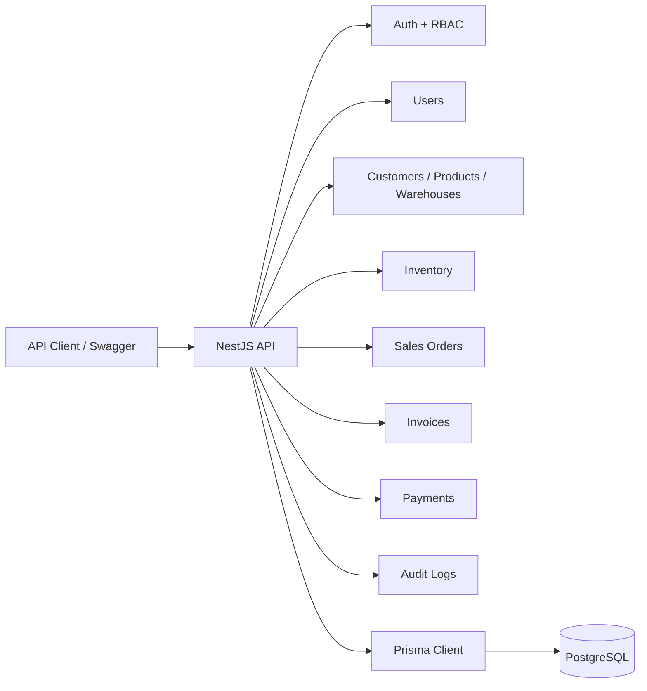
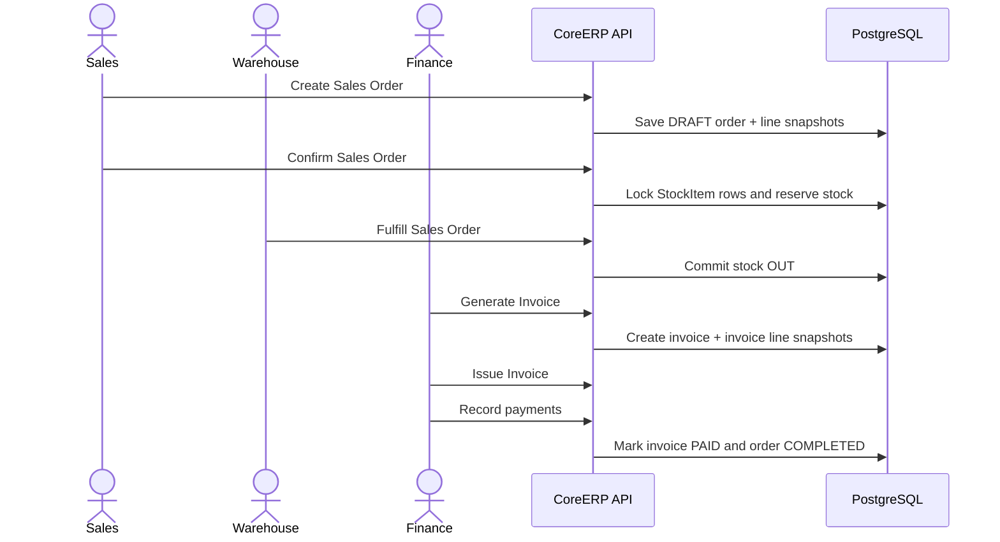
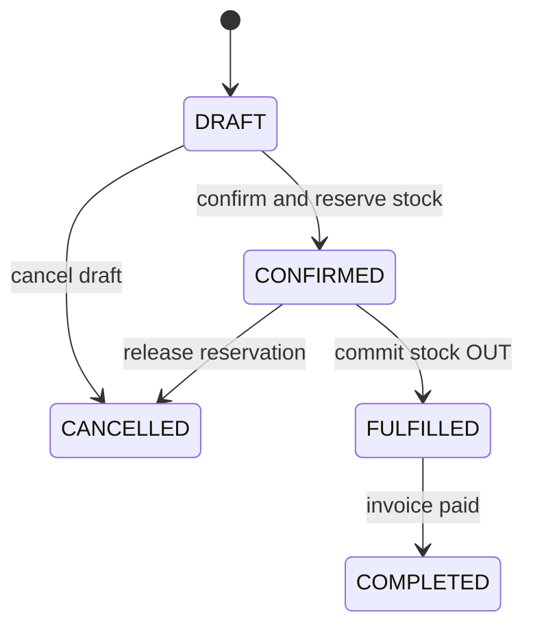
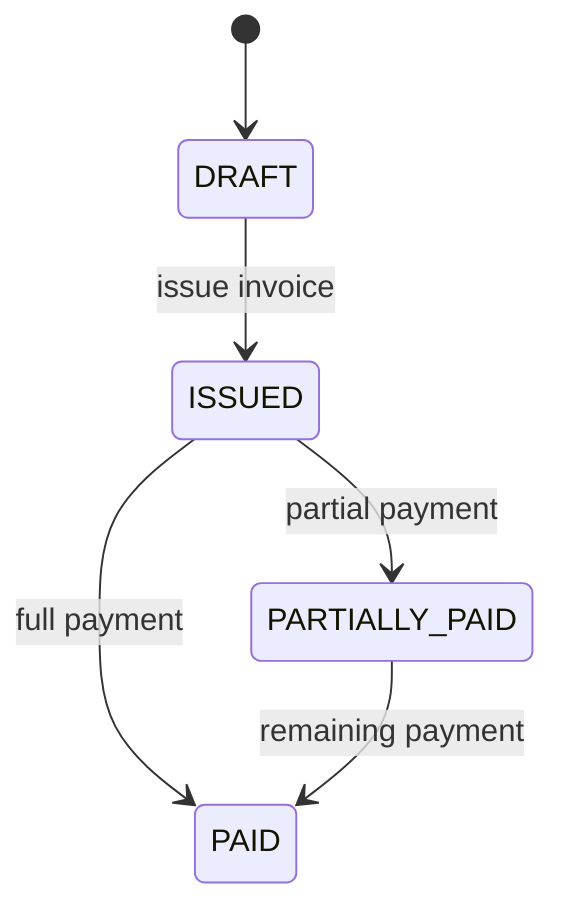
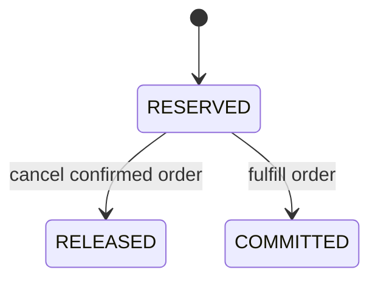

# CoreERP Documentation

CoreERP API is a SaaS-ready multi-tenant ERP backend for Vietnamese SMBs and an internal ERP admin / back-office system.

The MVP focuses on the Order-to-Cash workflow:

```text
Sales Order -> Stock Reservation -> Warehouse Fulfillment -> Invoice Snapshot -> Payment -> Order Completion
```

## Table Of Contents

- [Project Purpose](#project-purpose)
- [MVP Scope](#mvp-scope)
- [Tech Stack](#tech-stack)
- [Architecture](#architecture)
- [Modules](#modules)
- [Core Business Flow](#core-business-flow)
- [Role Matrix](#role-matrix)
- [Multi-Tenant Design](#multi-tenant-design)
- [Inventory Transaction Design](#inventory-transaction-design)
- [Invoice Snapshot Design](#invoice-snapshot-design)
- [Payment Positioning](#payment-positioning)
- [Redis/Valkey Positioning](#redisvalkey-positioning)
- [API Conventions](#api-conventions)
- [Endpoint Summary](#endpoint-summary)
- [Local Development](#local-development)
- [Demo Accounts](#demo-accounts)
- [Testing](#testing)
- [Known Limitations](#known-limitations)
- [Future Improvements](#future-improvements)
- [Technical Debt](#technical-debt)
- [CV Bullets](#cv-bullets)
- [Interview Talking Points](#interview-talking-points)

## Project Purpose

Small and medium businesses often need ERP-style workflows before they are ready for a large enterprise system. CoreERP demonstrates how to design a practical backend for tenant-scoped operations, inventory correctness, invoice snapshots, payments, audit logs, and clear REST API contracts.

The project is intentionally implemented as a modular monolith, which keeps the deployment model simple while still separating business capabilities cleanly. It is not an e-commerce checkout, legal e-invoice platform, payment gateway platform, microservices system, or 3PL warehouse platform.

## MVP Scope

Implemented:

- Tenant-scoped login with JWT.
- RBAC guard foundation.
- Tenant user management.
- Master data: customers, products, warehouses.
- Inventory: stock items, receipts, adjustments, movement ledger.
- Sales orders: create, list, detail, confirm, cancel, fulfill.
- Transactional stock reservation and stock OUT commit.
- Invoice generation from fulfilled sales orders.
- Invoice issue workflow.
- Partial and full payment recording.
- Sales order completion after fulfilled order is fully paid.
- Audit logs for key business actions.
- Swagger/OpenAPI documentation.
- Unit and E2E test coverage.

Not included in the backend MVP:

- Public tenant signup.
- Reports.
- Redis, Valkey, Kafka, Redpanda, or Outbox.
- Online payment gateway, payment links, provider webhook handling, refunds, or payment reconciliation.
- Printable invoice view, invoice PDF export, legal e-invoice integration, digital signature, or invoice email sending.
- Refunds/returns.
- Deployment automation or CI/CD.

## Tech Stack

- Node.js
- TypeScript strict mode
- NestJS
- PostgreSQL
- Prisma
- Docker Compose
- JWT + Passport
- RBAC guards/decorators
- Swagger/OpenAPI
- Jest + Supertest
- bcrypt

## Architecture



The application uses a single NestJS deployable and one PostgreSQL database. Module boundaries are organized by business capability, not by microservice.

## Modules

- `AuthModule`
- `UsersModule`
- `CustomersModule`
- `ProductsModule`
- `WarehousesModule`
- `InventoryModule`
- `SalesOrdersModule`
- `InvoicesModule`
- `PaymentsModule`
- `AuditLogsModule`
- `HealthModule`
- `PrismaModule`

## Core Business Flow



Sales order states:



Invoice states:



Reservation states:



## Role Matrix

| Capability | TENANT_ADMIN | SALES | WAREHOUSE | FINANCE | VIEWER |
|---|---:|---:|---:|---:|---:|
| Login and current user | yes | yes | yes | yes | yes |
| Manage tenant users | yes | no | no | no | no |
| Manage customers | yes | yes | no | no | no |
| Read master data | yes | yes | yes | yes | yes |
| Manage products | yes | no | no | no | no |
| Manage warehouses | yes | no | no | no | no |
| Receive/adjust stock | yes | no | yes | no | no |
| Create/confirm/cancel sales orders | yes | yes | no | no | no |
| Fulfill sales orders | yes | no | yes | no | no |
| Generate/issue invoices | yes | no | no | yes | no |
| Record payments | yes | no | no | yes | no |
| Read audit logs | yes | no | no | no | no |

## Multi-Tenant Design

- Every tenant-scoped query uses `currentUser.tenantId`.
- Client-provided `tenantId` is never trusted for business operations.
- Users, customers, products, warehouses, inventory, sales orders, invoices, payments, and audit logs are tenant-scoped.
- Tenant-scoped unique constraints exist for values such as user email, customer code, product SKU, warehouse code, and generated document codes.
- Cross-tenant relation IDs are validated through tenant-scoped lookups.
- DB-level composite tenant-scoped foreign key hardening is deferred; service-level ownership checks and E2E tenant isolation tests are implemented.

## Inventory Transaction Design

- `StockMovement` is an immutable ledger.
- Confirming a sales order increases `quantityReserved`.
- Confirming an order does not decrease `quantityOnHand`.
- Fulfillment decreases both `quantityOnHand` and `quantityReserved`.
- Cancellation of a confirmed order releases reservation by decreasing `quantityReserved`.
- PostgreSQL row-level locking is used for stock item updates during reservation, release, and fulfillment.
- Overselling is prevented by checking `quantityOnHand - quantityReserved` inside a transaction.

## Invoice Snapshot Design

- Sales order lines snapshot product SKU, product name, unit, unit price, and line total.
- Invoice lines are generated from sales order line snapshots.
- Product changes after order or invoice creation do not rewrite historical document lines.
- Invoice creation does not update stock, reservations, or stock movements.
- Payment updates invoice paid status and may complete the sales order, but does not update stock.
- The MVP invoice module stores invoice data, issue workflow state, line snapshots, and payment tracking.
- The MVP does not generate invoice PDFs, printable invoice views, legal e-invoices, digital signatures, or invoice emails.

## Payment Positioning

- Payments are manual finance-user payment records against issued invoices.
- The workflow supports partial payment, full payment, overpayment prevention, invoice status updates, and sales order completion when the order is fulfilled and fully paid.
- The MVP does not implement online payment gateways, payment links, payment provider webhooks, refunds, or payment reconciliation.
- A payment gateway adapter should only be considered later if a customer-facing payment link or portal flow is added.

## Redis/Valkey Positioning

- Redis/Valkey is intentionally not used in the MVP.
- PostgreSQL is the source of truth for orders, inventory, invoices, payments, and audit logs.
- Inventory correctness uses PostgreSQL transactions and row-level locking.
- Redis/Valkey may only be considered later for non-critical caching or rate limiting if a measured need appears.
- Redis/Valkey must not be used for inventory correctness, payment state, order state, invoice state, or audit logs.

## API Conventions

Success response:

```json
{
  "data": {}
}
```

Paginated response:

```json
{
  "data": [],
  "meta": {
    "page": 1,
    "limit": 20,
    "total": 100,
    "totalPages": 5
  }
}
```

Error response:

```json
{
  "error": {
    "code": "ERROR_CODE",
    "message": "Human-readable message",
    "details": {}
  }
}
```

Swagger UI:

```text
http://localhost:3000/api/docs
```

## Endpoint Summary

Base path:

```text
http://localhost:3000/api/v1
```

| Area | Endpoints |
|---|---|
| Health | `GET /health` |
| Auth | `POST /auth/login`, `GET /me` |
| Users | `POST /users`, `GET /users`, `PATCH /users/:id` |
| Customers | `POST /customers`, `GET /customers`, `GET /customers/:id`, `PATCH /customers/:id` |
| Products | `POST /products`, `GET /products`, `GET /products/:id`, `PATCH /products/:id` |
| Warehouses | `POST /warehouses`, `GET /warehouses`, `GET /warehouses/:id`, `PATCH /warehouses/:id` |
| Inventory | `GET /inventory/stock-items`, `POST /inventory/receipts`, `POST /inventory/adjustments`, `GET /inventory/movements` |
| Sales Orders | `POST /sales-orders`, `GET /sales-orders`, `GET /sales-orders/:id`, `PATCH /sales-orders/:id/confirm`, `PATCH /sales-orders/:id/cancel`, `PATCH /sales-orders/:id/fulfill` |
| Invoices | `POST /invoices/from-sales-order/:salesOrderId`, `PATCH /invoices/:id/issue`, `GET /invoices`, `GET /invoices/:id` |
| Payments | `POST /invoices/:id/payments`, `GET /payments` |
| Audit Logs | `GET /audit-logs` |

## Local Development

Install dependencies:

```bash
npm install
```

Create a local environment file:

```bash
cp .env.example .env
```

Start PostgreSQL:

```bash
docker compose up -d
```

Run migrations, generate Prisma Client, and seed demo data:

```bash
npm run prisma:migrate
npm run prisma:generate
npm run db:seed
```

Start the API:

```bash
npm run start:dev
```

On Windows PowerShell, use `npm.cmd` if script execution policy blocks `npm`.

Environment variables in `.env.example`:

- `NODE_ENV`
- `PORT`
- `DATABASE_URL`
- `JWT_ACCESS_SECRET`
- `JWT_ACCESS_EXPIRES_IN`
- `FRONTEND_ORIGIN`
- `POSTGRES_DB`
- `POSTGRES_USER`
- `POSTGRES_PASSWORD`
- `POSTGRES_PORT`

For local React admin development, set:

```text
FRONTEND_ORIGIN=http://localhost:5173,http://127.0.0.1:5173
```

The backend allows these origins for CORS with common REST methods and `Content-Type` / `Authorization` headers. Credentials are not enabled because the API uses Bearer tokens, not cookies.

## Demo Accounts

All demo accounts use password `123456`.

| tenantCode | email | role |
|---|---|---|
| minh-anh-retail | admin@minhanh.vn | TENANT_ADMIN |
| minh-anh-retail | sales@minhanh.vn | SALES |
| minh-anh-retail | warehouse@minhanh.vn | WAREHOUSE |
| minh-anh-retail | finance@minhanh.vn | FINANCE |
| minh-anh-retail | viewer@minhanh.vn | VIEWER |
| hoang-long-fashion | admin@hoanglong.vn | TENANT_ADMIN |
| hoang-long-fashion | sales@hoanglong.vn | SALES |
| hoang-long-fashion | warehouse@hoanglong.vn | WAREHOUSE |
| hoang-long-fashion | finance@hoanglong.vn | FINANCE |
| hoang-long-fashion | viewer@hoanglong.vn | VIEWER |

## Testing

Run the full suite:

```bash
npm test -- --runInBand
```

Recommended checks:

```bash
npm run build
npm run lint
npm test -- --runInBand
npm run prisma:validate
```

E2E coverage includes:

- Full Order-to-Cash happy path.
- Tenant isolation.
- RBAC restrictions.
- Overselling prevention.
- Cancel/release reservation.
- Invoice snapshot behavior.
- Payment rules.
- Audit logs.
- Payment and invoice flows not mutating stock.

## Known Limitations

- The separate React admin frontend lives in `coreerp-admin`; Swagger remains the API reference.
- No public tenant signup yet; demo tenants are seeded.
- One user belongs to one tenant in the MVP.
- Warehouse is a tenant-scoped logical warehouse in the MVP.
- One sales order uses one warehouse in the MVP.
- No Redis, Kafka, Redpanda, or Outbox in the MVP.
- No reports module in the MVP.
- No online payment gateway, payment links, provider webhooks, refunds, reconciliation, returns, or payment cancellation.
- No printable invoice view, invoice PDF export, legal e-invoice integration, digital signature, or invoice email sending.
- No production deployment or CI/CD yet.
- DB-level composite tenant-scoped foreign key hardening is deferred; service-level tenant ownership checks and tests are implemented.
- Prisma seed configuration currently lives in `package.json#prisma`; Prisma warns this will change in Prisma 7.

## Future Improvements

- Printable invoice view / PDF export.
- GitHub Actions CI for lint, build, and test.
- Frontend E2E tests with Playwright.
- Reports/read models for revenue, unpaid invoices, and low stock.
- Composite tenant-scoped foreign key hardening.
- Platform tenant onboarding.
- Deployment guide.
- Optional payment gateway adapter and webhook simulation only if a customer-facing payment flow is added.
- Optional e-invoice provider abstraction only if legal invoice integration is needed.
- Optional Outbox pattern with Kafka/Redpanda only if async integration or service split becomes necessary.
- Optional Redis/Valkey only for non-critical caching or rate limiting after measured need.

## Technical Debt

- DB-level composite tenant-scoped FK hardening is deferred.
- Prisma seed configuration currently lives in `package.json#prisma`; Prisma warns this will change in Prisma 7.
- CI/CD is not implemented yet.
- Deployment is not implemented yet.

## CV Bullets

- Built a multi-tenant ERP backend with JWT/RBAC, tenant-scoped data isolation, and Swagger-documented REST APIs.
- Implemented transactional stock reservation using PostgreSQL row-level locking to prevent overselling.
- Designed invoice snapshot and payment workflow with partial/full payment and order completion.
- Added audit logging for key business actions across users, master data, inventory, sales, invoices, and payments.
- Wrote E2E tests covering Order-to-Cash, RBAC, tenant isolation, inventory edge cases, invoice snapshots, and payment rules.

## Interview Talking Points

- Why a modular monolith is a good fit for an SMB ERP MVP.
- How service-level tenant isolation is enforced and tested.
- How PostgreSQL row-level locking prevents inventory race conditions.
- Why invoice lines must snapshot sales order line data.
- How partial payment, full payment, invoice status, and sales order completion interact.
- Where audit logging belongs in transaction boundaries.
- Which tradeoffs are intentionally deferred: reports, composite tenant-scoped FKs, deployment, and optional infrastructure such as Redis/Valkey or Outbox/Kafka only after a measured need.
